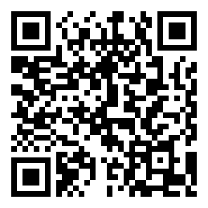

# PawaPay Builders : CITS26



Encaissez des paiements mobile money dans votre projet du Bootcamp. MTN MoMo et Orange Money, Cameroun, dans le langage de votre choix.

🇬🇧 **[Read in English](README.md)**

Ce kit s'adresse aux équipes du **Cameroon International Tech Summit 2026** (CITS26), au Palais des Congrès de Yaoundé. Le National Innovation Bootcamp a lieu le 14 octobre et le Summit du 15 au 17 octobre. Les équipes sont évaluées sur les contrats conclus pendant le Summit : votre produit doit pouvoir encaisser un paiement.

PawaPay donne à chaque équipe un accès gratuit à un sandbox partagé : une copie de test du système de paiement, où aucun argent réel ne circule.

## Votre premier paiement en 15 minutes

1. **Demandez l'accès.** Chaque membre de l'équipe remplit le [formulaire d'inscription](https://docs.google.com/forms/d/e/1FAIpQLScC-s8bw7OKarp2PFg6xgOXXvGmgezpWpS5I69ZY54v3miOFg/viewform) avec l'adresse e-mail à utiliser sur le dashboard. Acceptez ensuite l'invitation envoyée par PawaPay.
2. **Créez un token** dans le [dashboard sandbox](https://dashboard.sandbox.pawapay.io), rubrique **Developers → Create API Token**. Copiez-le tout de suite : PawaPay ne l'affiche qu'une fois.
3. **Lancez un paiement :**

   ```bash
   git clone https://github.com/joelpawapay/pawapay-builders-cits26.git
   cd pawapay-builders-cits26/examples
   cp .env.example .env        # collez votre token dans .env
   node node/deposit.mjs       # ou python3 python/deposit.py, ou php php/deposit.php
   ```

4. **Le message `Payment received.` s'affiche.** Vous venez d'encaisser 1000 XAF depuis un numéro MTN de test.

Bloqué à une étape ? [getting-started.md](getting-started.md) détaille chacune d'elles (en anglais).

## Choisissez votre approche

| Vous construisez | Commencez par |
| --- | --- |
| Un site web, avec le moins de code possible | La page de paiement hébergée : PawaPay affiche le formulaire. [`examples/node/payment-page.mjs`](examples/node/payment-page.mjs) |
| Une application, une API, un service USSD ou un bot | L'API de dépôt. [`examples/`](examples/) contient du Node, du Python, du PHP et du curl |
| Une boutique WordPress | Le [plugin WooCommerce](plugin/) |
| N'importe quoi, avec Claude comme binôme | Le [skill Claude](skill/). Il écrit du code PawaPay qui fonctionne sur le sandbox |
| Rien encore, vous explorez l'API | La [collection Postman](examples/postman/) |

Jamais intégré d'API de paiement ? Lisez d'abord [how-payments-work.md](how-payments-work.md). Cinq minutes suffisent.

## Numéros de test au Cameroun

Dans le sandbox, le numéro de téléphone décide du résultat. Aucun téléphone ne sonne.

| Résultat | MTN (`MTN_MOMO_CMR`) | Orange (`ORANGE_CMR`) |
| --- | --- | --- |
| Paiement réussi | `237653456789` | `237693456789` |
| Échec : PIN non validé (`PAYMENT_NOT_APPROVED`) | `237653456039` | `237693456039` |
| Échec : solde insuffisant (`INSUFFICIENT_BALANCE`) | aucun | `237693456049` |
| Reste en attente | `237653456129` | `237693456129` |

La liste complète se trouve dans [getting-started.md](getting-started.md#cameroon-sandbox-numbers).

## PawaPay pendant l'événement

| Quand | Session |
| --- | --- |
| 14 oct., 09h00 | Intervention devant la cohorte du Bootcamp |
| 14 oct., 11h00 | Clinique d'intégration. Venez avec un ordinateur, repartez avec un paiement sandbox qui fonctionne |
| 15 oct., dès 12h00 | Stand PawaPay, ouvert à toute question d'intégration |
| 15 oct., 14h00 | Fireside chat sur l'infrastructure PawaPay, scène principale |
| 16 oct., 09h00 | Atelier développeurs, 90 minutes. Venez avec un problème qui vous bloque |

Horaires issus du programme provisoire. Vérifiez le programme imprimé sur place.

Pour retrouver vos transactions, ajoutez à chacune le metadata `team` (les exemples le font), puis tapez la valeur exacte dans la barre de recherche du dashboard : la recherche ne trouve que la valeur complète. Voir [tracking-transactions.md](tracking-transactions.md).

Le compte sandbox est partagé entre toutes les équipes. Ne modifiez pas les **Callback URLs** ni **API Security** dans le dashboard, et ne révoquez que votre propre token : sinon, les callbacks de toutes les équipes s'arrêtent.

Pour profiter au mieux de la clinique, acceptez votre invitation et créez votre token avant 11h00 le 14.

## Cinq règles qui vous feront gagner un après-midi

1. `ACCEPTED` signifie que PawaPay a reçu la demande. Attendez `COMPLETED` avant de livrer quoi que ce soit.
2. Les montants sont des chaînes, sans décimales en XAF : `"1000"`.
3. Les numéros contiennent l'indicatif pays et rien d'autre : `237653456789`.
4. Générez vous-même l'identifiant de transaction (un UUIDv4) et enregistrez-le avant d'appeler PawaPay.
5. Appelez PawaPay depuis votre serveur. Un token placé dans le code d'un navigateur ou d'une application mobile peut être copié par n'importe qui.

## Messages d'erreur pour vos clients

[troubleshooting.md](troubleshooting.md) liste chaque code d'erreur avec sa solution, et propose pour chaque échec de paiement un message prêt à afficher, en français et en anglais.

## Besoin d'aide ?

- **Accès au sandbox et callbacks** : le [formulaire d'inscription](https://docs.google.com/forms/d/e/1FAIpQLScC-s8bw7OKarp2PFg6xgOXXvGmgezpWpS5I69ZY54v3miOFg/viewform)
- **Toute autre question** : Joel, joel.amoako@pawapay.co.uk
- **Sur place** : Dave Evans (du 14 au 16 octobre) et l'équipe PawaPay Cameroun au stand
- **Un code d'erreur** : [troubleshooting.md](troubleshooting.md)

Bonne chance. Construisez quelque chose pour lequel les gens paient.
