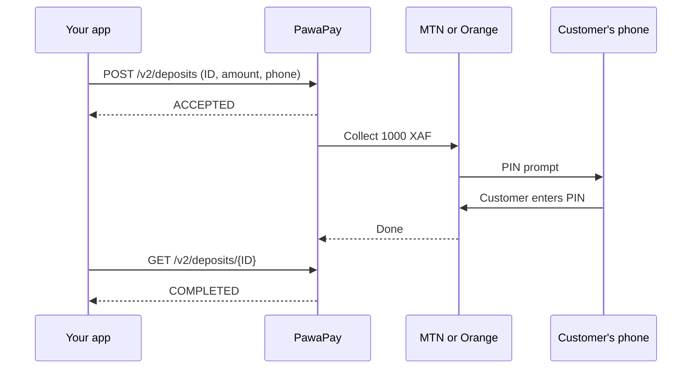

# How a mobile money payment works

Read this if you've never connected an app to a payment API. It explains what happens between "customer taps Pay" and "money arrives", and where PawaPay sits in that flow.

## The three parties

- Your app: the shop, booking tool, or service your team builds.
- PawaPay: one API that connects your app to the mobile money operators.
- The operator: MTN MoMo or Orange Money in Cameroon. The customer's money sits in a wallet the operator runs.

You write code against one API. PawaPay talks to each operator for you, so adding Orange Money next to MTN MoMo needs no extra integration.

## Collecting money: a deposit

PawaPay calls money coming in from a customer a deposit. A deposit runs in five steps:

1. Your app creates a unique ID for the payment (a UUIDv4) and saves it.
2. Your app sends PawaPay the ID, the amount, the currency (`XAF`), the customer's phone number, and the operator.
3. PawaPay replies `ACCEPTED`. No money has moved yet.
4. The operator sends a prompt to the customer's phone. The customer enters their PIN to approve.
5. The deposit ends as `COMPLETED` or `FAILED`. Your app learns the result by asking PawaPay (polling) or by receiving a callback.

Step 3 trips up most first integrations. `ACCEPTED` means PawaPay received the request. Wait for `COMPLETED` before you deliver the goods.

In the sandbox, step 4 is skipped. No phone rings, and the deposit completes in a few seconds.

## The no-UI option: hosted checkout

If you don't want to build a payment form, ask PawaPay for a **payment page**. Your server sends the amount, and PawaPay returns a link. The customer opens the link, types their number, and pays. PawaPay then sends them back to your site, and your server checks the status of the deposit. See [`examples/node/payment-page.mjs`](examples/node/payment-page.mjs).

## Sending money: a payout

A payout runs the same flow in reverse: your app sends money from your PawaPay balance to a customer's wallet. Use it for refunds, seller earnings, prizes, or cash-back. A payout can sit in `ENQUEUED` while the operator is slow, then completes when the operator recovers.

A refund returns all or part of a completed deposit to the customer who paid.

## The rules that matter

- Make your own ID first, and save it before you call PawaPay. If your request times out, you can ask PawaPay for that ID's status. Sending the same ID twice returns `DUPLICATE_IGNORED`, so a retry never charges a customer twice.
- Send amounts as strings. `"1000"`, not `1000` or `1000.0`. XAF has no decimal places.
- Write phone numbers with the country code and nothing else. `237653456789`. PawaPay's `predict-provider` endpoint cleans up whatever the customer typed and tells you which operator the number belongs to.
- Handle failure. Customers cancel, run out of balance, or ignore the prompt. Show them a clear message and let them try again.

## Where to go next

- [getting-started.md](getting-started.md) to make your first sandbox deposit
- [examples/](examples/) for code you can copy
- [What's mobile money?](https://docs.pawapay.io/v2/docs/whats_mobile_money): PawaPay's own introduction, including how it differs from card payments
- [What you should know](https://docs.pawapay.io/v2/docs/what_to_know): asynchronous payments, callbacks, and other mobile money details
- PawaPay guides for [deposits](https://docs.pawapay.io/v2/docs/deposits), [payouts](https://docs.pawapay.io/v2/docs/payouts), [refunds](https://docs.pawapay.io/v2/docs/refunds), and the [payment page](https://docs.pawapay.io/v2/docs/payment_page)
- The [Claude skill](skill/README.md) to write the code with you
